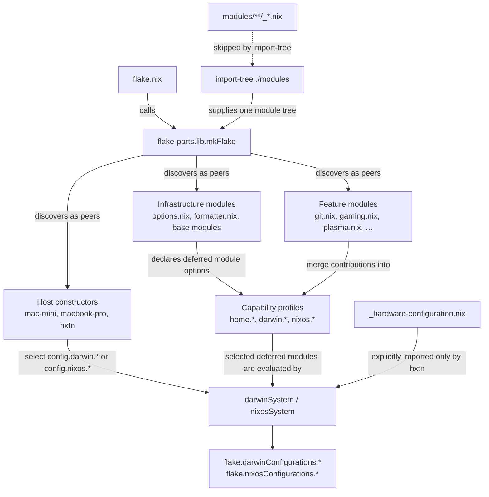
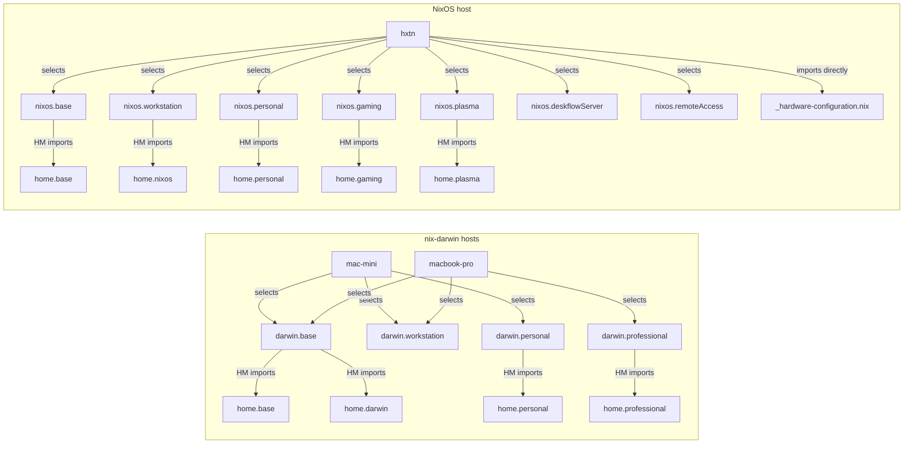

# Module loading and composition

> Interactive companion: open [`docs/architecture.html`](./architecture.html) in a
> browser to walk the same graphs host-by-host (pick a machine, hover a profile,
> preview the plasma→hyprland swap).

This repository does not have a conventional tree in which a host imports a
list of feature files. There are two distinct operations:

1. `import-tree` discovers almost every `.nix` file under `modules/` and gives
   all of them to flake-parts as peer modules.
2. Those peer modules merge definitions into deferred capability profiles.
   A host constructor selects profiles, and the selected system profiles then
   import reusable Home Manager profiles or contain tightly scoped user
   settings directly.

An arrow labelled **discovers** below means flake-parts module discovery. An
arrow labelled **selects** or **HM imports** means Nix module composition.

## 1. Evaluation pipeline



The important consequence is that `modules/hosts/` is still the top of the
**configuration selection** graph, but it is not the top of the **file loading**
graph. `import-tree` loads the host files and feature files alongside each
other. The host files select the profile values that those features have built.

### Source-order convention

When a feature contributes to more than one configuration layer, its source is
ordered `darwin.*`, then `nixos.*`, then `home.*`. This follows the most useful
reading path: a host selects a system profile, and that system profile imports
the lower-level Home Manager profile.

This order is solely for people reading the repository. Nix merges these
definitions by option path; their textual order does not control evaluation.

## 2. Profiles selected by each host



`darwin.personal` also contains its Mac-only user settings directly below
`home-manager.users.thomashexton`. They remain scoped to the personal Mac
profile without introducing another `home.*` profile or graph node.

`nixos.hyprland` is an alternative to `nixos.plasma`, not an additional profile
in the current `hxtn` build. If that one selection changes, it imports
`home.hyprland` instead of `home.plasma`.

## 3. Files that contribute to each profile

Multiple files can assign to the same profile. Nix merges those assignments;
the profile is not owned by whichever file happens to appear first.

| Profile | Contributing files |
| --- | --- |
| `darwin.base` | `aerospace.nix`, `appcleaner.nix`, `base/darwin.nix`, `base/unstable-overlay.nix`, `codex/codex.nix`, `developer-tools.nix`, `deskflow.nix`, `homebrew.nix`, `karabiner/karabiner.nix`, `shell.nix` |
| `darwin.workstation` | `alacritty/alacritty.nix`, `fonts.nix`, `git.nix`, `tmux.nix`, `zed.nix` |
| `darwin.personal` | `1password.nix`, `base/darwin.nix`, `claude/claude.nix`, `cursor.nix`, `dropbox.nix`, `metadatics.nix`, `streamrip.nix`, `zsh.nix` |
| `darwin.professional` | `base/darwin.nix` |
| `nixos.base` | `base/nixos.nix`, `base/unstable-overlay.nix`, `codex/codex.nix`, `shell.nix` |
| `nixos.workstation` | `base/nixos.nix`, `alacritty/alacritty.nix`, `audio.nix`, `developer-tools.nix`, `fonts.nix`, `git.nix`, `graphics.nix`, `keyboard.nix`, `zed.nix` |
| `nixos.personal` | `1password.nix`, `base/nixos.nix`, `claude/claude.nix`, `cursor.nix`, `dropbox.nix` |
| `nixos.gaming` | `base/nixos.nix`, `gaming.nix` |
| `nixos.plasma` | `plasma.nix` |
| `nixos.hyprland` | `hyprland.nix` |
| `nixos.deskflowServer` | `deskflow.nix` |
| `nixos.remoteAccess` | `remote-access.nix` |
| `home.base` | `base/home.nix`, `claude/claude.nix`, `codex/codex.nix` |
| `home.darwin` | `karabiner/karabiner.nix` |
| `home.nixos` | `zed.nix` |
| `home.personal` | `alacritty/alacritty.nix`, `developer-tools.nix`, `git.nix`, `tmux.nix` |
| `home.professional` | `claude/canva.nix` |
| `home.gaming` | `gaming.nix` |
| `home.plasma` | `plasma.nix` |
| `home.hyprland` | `hyprland.nix` |

There are three further nested imports from external flake inputs:

- `darwin.base` imports the Determinate and Home Manager nix-darwin modules.
- `nixos.base` imports the Home Manager NixOS module.
- `nixos.gaming` imports the `nix-citizen` NixOS module.

In short, the path to keep in mind is:

```text
flake.nix -> import-tree -> peer flake-parts modules -> merged profiles
          -> host selects system profiles -> system profiles import home profiles
          -> final nix-darwin or NixOS configuration
```
