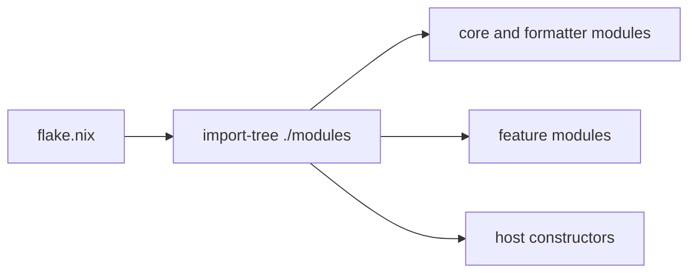
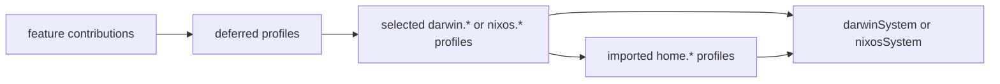

# Module loading and composition

This repository has separate discovery and selection graphs. Treating them as
one import hierarchy makes the configuration harder to trace.

## Discovery

`flake.nix` calls `flake-parts.lib.mkFlake` with the result of
`import-tree ./modules`. Import-tree discovers every `.nix` file below
`modules/`, except paths containing `/_`, and supplies them as peer flake-parts
modules.

File location does not select a host or impose evaluation order. Core modules,
features, and host constructors are discovered together. The generated
`modules/hosts/hxtn/_hardware-configuration.nix` is skipped by import-tree and
imported explicitly by the `hxtn` host constructor.

## Selection

`modules/core/options.nix` declares the permitted `darwin.*`, `nixos.*`, and
`home.*` deferred-module profiles. Feature modules merge configuration into
those profiles. Host constructors select system profiles, and the selected
system profiles import the Home Manager profiles they require.

Hosts never select `home.*` profiles directly. Profile names are independent
labels rather than an inheritance hierarchy: selecting `darwin.personal`, for
example, does not implicitly select `darwin.base`.

## Placing changes

- Add reusable application or service behavior to a feature module under
  `modules/`, then contribute it to the profiles that need it.
- Change a host's selected capabilities in its file under `modules/hosts/`.
- Keep machine identity, boot, hardware, and state-version values in the host
  constructor.
- Declare a new profile in `modules/core/options.nix` only for a capability that
  hosts must be able to select independently.

The configuration files are the source of truth for the current profile and
host membership; this document intentionally does not duplicate exhaustive
profile matrices.
